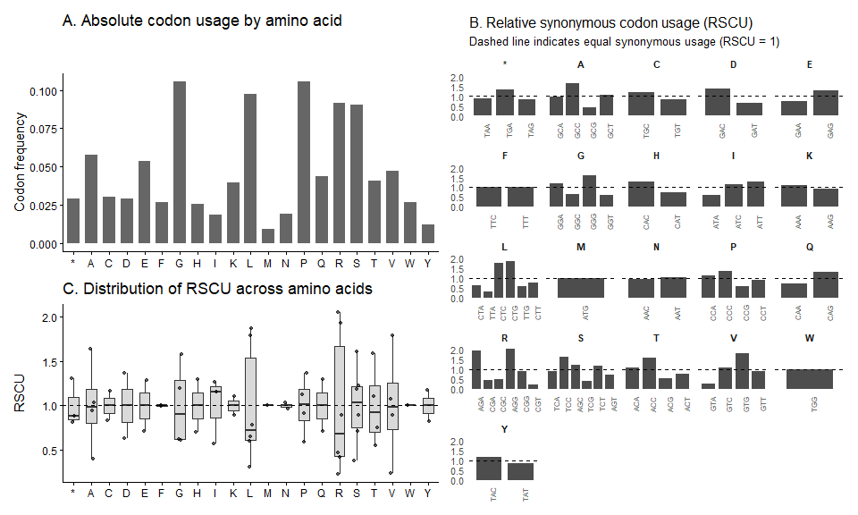

<!-- README.md is generated from README.Rmd. Please edit that file -->

# GeneScout <a href="https://danymukesha.github.io/GeneScout/"></a>

<!-- badges: start -->

<!-- badges: end -->

**GeneScout** is an R package for identifying hidden genes in non-coding
DNA using statistical information theory. It implements sliding window
entropy scanning, Shannon entropy estimation, and Kullback–Leibler
divergence to discover potential small open reading frames (sORFs)
directly from genomic sequences without requiring prior annotation.

<!-- Most existing bioinformatics tools for codon usage analysis, such as -->

<!-- **coRdon**, are designed to operate on *known* protein-coding genes derived -->

<!-- from annotated GTF or GFF files. Core infrastructure packages such as -->

<!-- **Biostrings** provide efficient manipulation of biological sequences but do -->

<!-- not offer functionality for genome-wide *de novo* discovery of coding regions. -->

<!-- Consequently, these tools are not optimized for systematic exploration of -->

<!-- large, unannotated genomic regions. -->

Most existing bioinformatics tools for codon usage bias analysis (like
`coRdon` and `Biostrings`) are designed for analyzing **known** genes
from annotated GTF/GFF files. They are not optimized for **discovery**
in non-coding regions.

<!-- **GeneScout fills this methodological gap** by focusing on *de novo* small ORF -->

<!-- discovery through statistical modeling of local codon usage patterns in large -->

<!-- genomic regions. -->

**GeneScout fills this gap** by focusing on *de novo* small ORF
discovery in large genomic regions.

Here are the key features of the tool has:

- **Sliding window entropy scanning**: This implementation efficiently
  scan millions of base pairs to find regions with unusual codon usage
  patterns
- **Shannon entropy calculation**: This quantifies the randomness of
  codon distributions within genomic windows.
- **Kullback-Leibler divergence**: Compare regions to organism-specific
  codon usage profiles.
  <!-- Compares local codon usage to organism-specific reference profiles -->
- **ORF detection**: Identifies candidate open reading frames within
  low-entropy regions
- **Reference profile construction** Builds organism-specific codon
  usage profiles from known coding sequences

## Installation

``` r
# install development version
devtools::install_github("danymukesha/GeneScout")
```

## Quick Start

``` r
library(GeneScout)

# Create a reference profile from known genes
fasta_tp53 <- system.file("extdata", "TP53.fasta.gz", package = "GeneScout")
fasta_apoe <- system.file("extdata", "APOE.fasta.gz", package = "GeneScout")

known_genes <- c(
  APOE = read_fasta(fasta_apoe)[[1]],
  TP53 = read_fasta(fasta_tp53)[[1]]
)
known_genes
#> $APOE
#> 2075-letter DNAString object
#> seq: GGGAGCCGGCCCAGCTGGGGGCCCAGGTGGTGCACC...GGACAGACAAGCAGGCGTAGGATGGGCAATTGGATT
#> 
#> $TP53
#> 21089-letter DNAString object
#> seq: CTTTTGAAAGCACTGTGTTCCTTAGCACCGCGGGTC...CTTTCTTACTAGGGAATGCCAAACACTCTCCCCAGG

ref_profile <- create_reference_profile(read_fasta(fasta_apoe))
ref_profile
#>         AAA         CAA         GAA         TAA         ACA         CCA 
#> 0.021952221 0.015496277 0.019114222 0.008485817 0.011295637 0.029686270 
#>         GCA         TCA         AGA         CGA         GGA         TGA 
#> 0.013522761 0.013438225 0.029329005 0.006455944 0.031556129 0.012601921 
#>         ATA         CTA         GTA         TTA         AAC         CAC 
#> 0.003533409 0.010628405 0.002837999 0.004980587 0.009265763 0.016774383 
#>         GAC         TAC         ACC         CCC         GCC         TCC 
#> 0.019753275 0.007066818 0.016304403 0.036226750 0.023483935 0.024179345 
#>         AGC         CGC         GGC         TGC         ATC         CTC 
#> 0.018390633 0.007179533 0.016388939 0.017554330 0.007123175 0.029103575 
#>         GTC         TTC         AAG         CAG         GAG         TAG 
#> 0.012714636 0.013550940 0.017667044 0.028267271 0.034337770 0.007818585 
#>         ACG         CCG         GCG         TCG         AGG         CGG 
#> 0.005704176 0.015665350 0.005704176 0.005704176 0.031302521 0.013663655 
#>         GGG         TGG         ATG         CTG         GTG         TTG 
#> 0.041545481 0.026820093 0.009096691 0.030353502 0.021200453 0.009848459 
#>         AAT         CAT         GAT         TAT         ACT         CCT 
#> 0.009989352 0.009153049 0.009181227 0.004980587 0.007734049 0.024122988 
#>         GCT         TCT         AGT         CGT         GGT         TGT 
#> 0.014800867 0.017779759 0.010712941 0.003533409 0.016191688 0.012573743 
#>         ATT         CTT         GTT         TTT 
#> 0.007790407 0.012742815 0.010572048 0.013466404
```

``` r
df <- GeneScout::codon_frequency_df(ref_profile)
plot_codon_usage_panel(df)
```



``` r
# ggsave(filename = "inst/apoe.png", 
#        plot_codon_usage_panel(df), 
#        height = 8, width = 12)
```

``` r
# Scan a genomic sequence
fasta_chr19 <- system.file("extdata", "chr19.fasta.gz", package = "GeneScout")
sequence <- read_fasta(fasta_chr19)[[30]]
sequence
#> 61764-letter DNAString object
#> seq: TCCTACTGGGCATGCCCCTGGCTTTACCCAGAGGGG...CACTCTGACGCACACTACGTCTGGAGCCACAGAGTG

scan_result <- sliding_window_scan(
  sequence,
  window_size = 300,
  step_size = 30,
  reference_profile = ref_profile
)
scan_result
#> GeneScout Sliding Window Scan Results
#> =======================================
#> Number of windows: 2049 
#> Sequence range: 1 - 61740 bp
#> 
#> Entropy Statistics:
#>   Mean Shannon Entropy: 5.216 bits
#>   Std. Dev. Shannon Entropy: 0.224 bits
#>   Min Shannon Entropy: 3.226 bits
#>   Max Shannon Entropy: 5.582 bits
#> 
#> KL Divergence Statistics:
#>   Mean KL Divergence: 0.879 
#>   Std. Dev. KL Divergence: 0.361
```

``` r
# Detect entropy peaks and find candidate ORFs
peaks <- entropy_peak_detection(scan_result, threshold = 0.1)
candidates <- find_candidate_orfs(sequence, scan_result, peaks)

plot_candidate_orfs(scan_result, candidates, peaks)
#> Warning: ggrepel: 207 unlabeled data points (too many overlaps). Consider
#> increasing max.overlaps
```


## Theory

### Shannon Entropy

$$H = -\sum_{i=1}^{64} P(i) \log_2 P(i)$$

- **High entropy** (~6 bits): Random codon usage → non-coding DNA
- **Low entropy** (~3-4 bits): Biased codon usage → potential
  gene/coding regions

### Kullback-Leibler Divergence

$$D_{KL}(P \| Q) = \sum_{i} P(i) \log_2 \left( \frac{P(i)}{Q(i)} \right)$$

Compares the observed codon distribution ($P$) to the reference
distribution ($Q$). There are different use cases, few of them would be:

1.  **De novo gene discovery**: to find potential coding regions in
    unannotated genomes
2.  **Small ORF identification**: for discovering small peptides in
    non-coding regions
3.  **Comparative genomics**: comparing codon usage between organisms
4.  **RNA-Seq integration**: validating candidate ORFs with expression
    data
5.  **Evolutionary studies**: to analze codon usage patterns across
    lineages

<!-- ## Large-Scale Analysis -->

<!-- For chromosome-scale analysis examples, see: -->

<!-- - **`chr19-large-scale-analysis.Rmd`**: Full chromosome 19 analysis with APOE/TP53 references -->

<!-- - **`gencode-chr19-analysis.Rmd`**: GENCODE-informed analysis (recommended) -->

<!-- - **Memory-optimized processing** for genome-wide studies -->

<!-- - **Performance benchmarking** and efficiency metrics -->

<!-- - **Visualizations** with biological context  -->

<!-- ### GENCODE Integration -->

<!-- GeneScout now supports **GENCODE protein-coding transcripts** for: -->

<!-- - **Human reference**: 93,000+ curated transcripts -->

<!-- - **Robust codon bias patterns**: Organism-specific analysis -->

<!-- - **Scientifically rigorous**: High-quality annotation standards -->

<!-- - **Production pipelines**: Scalable chromosome-level analysis -->

## Acknowledgments

Built on top of Bioconductor’s excellent `Biostrings`, and `coRdon`
packages.
<!-- GeneScout builds upon Bioconductor infrastructure, particularly -->
<!-- Biostrings for sequence manipulation and coRdon for codon usage -->
<!-- bias methodology. -->
