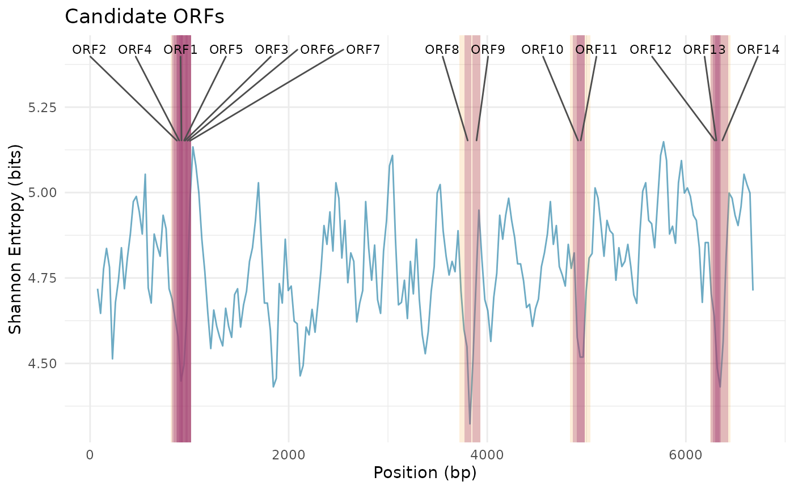

# GeneScout on APOE and chr19

Abstract

Demonstration of `GeneScout` to identify hidden small open reading
frames (ORFs) in human genomic sequences using data from chromosome 19
and APOE gene.

## Introduction

Many genomes studied in detail still contain regions of DNA once thought
to be “non-coding”, but some of these regions may actually hide small
genes. `GeneScout` uses **codon usage statistics** and **entropy
analysis** to identify these hidden genes by analyzing patterns in how
DNA codes for proteins and measuring sequence complexity.

Here we demonstrate it using:

- **APOE gene** as a known coding reference.
- **Chromosome 19 segments** (`chr19`) as the genome to scan.

------------------------------------------------------------------------

## Load Data

``` r
# fasta_path <- system.file("extdata", "APOE.fasta.gz", package = "GeneScout")
chr19 <- GeneScout::read_fasta("../inst/extdata/chr19.fasta.gz")
apoe_sequence <-  GeneScout::read_fasta("../inst/extdata/APOE.fasta.gz")[1]
```

``` r
# chr19: DNAStringSet with multiple segments
# apoe_sequence: DNAStringSet containing APOE
chr19_seq <- chr19[[460]]         # take 460 segment for demonstration
apoe_seq <- apoe_sequence[[1]]    # APOE gene sequence
```

------------------------------------------------------------------------

## Codon Frequency and Shannon Entropy

``` r
# Calculate codon frequencies for APOE
apoe_codon_freq <- calculate_codon_frequencies(apoe_seq)
print(head(apoe_codon_freq[apoe_codon_freq > 0]))
```

    ##         AAA         CAA         GAA         TAA         ACA         CCA 
    ## 0.020260492 0.010130246 0.017366136 0.007235890 0.008683068 0.024602026

``` r
# Shannon entropy of APOE sequence
apoe_entropy <- calculate_shannon_entropy(apoe_codon_freq)
paste("APOE Shannon Entropy:", round(apoe_entropy, 3), "bits")
```

    ## [1] "APOE Shannon Entropy: 5.624 bits"

------------------------------------------------------------------------

## Create Reference Profile

``` r
# Using APOE as the reference gene for codon usage
ref_profile <- create_reference_profile(list(apoe_seq), method = "mean")
print(head(ref_profile[ref_profile > 0]))
```

    ##         AAA         CAA         GAA         TAA         ACA         CCA 
    ## 0.020260492 0.010130246 0.017366136 0.007235890 0.008683068 0.024602026

------------------------------------------------------------------------

## Sliding Window Scan of chr19

We scan **the full segment** of chr19 (safe coordinates):

``` r
chr19_region <- subseq(chr19_seq, start = 1, end = length(chr19_seq))
```

## Sliding window scan

``` r
scan_result <- sliding_window_scan(
    chr19_region,
    window_size = 150,
    step_size = 30,
    reference_profile = ref_profile
)
```

``` r
# Inspect first few rows
head(scan_result)
```

    ## GeneScout Sliding Window Scan Results
    ## =======================================
    ## Number of windows: 6 
    ## Sequence range: 1 - 300 bp
    ## 
    ## Entropy Statistics:
    ##   Mean Shannon Entropy: 4.712 bits
    ##   Std. Dev. Shannon Entropy: 0.117 bits
    ##   Min Shannon Entropy: 4.513 bits
    ##   Max Shannon Entropy: 4.837 bits
    ## 
    ## KL Divergence Statistics:
    ##   Mean KL Divergence: 1.397 
    ##   Std. Dev. KL Divergence: 0.149

------------------------------------------------------------------------

## Detect Low-Entropy Peaks

``` r
peaks <- entropy_peak_detection(
    scan_result,
    metric = "shannon_entropy",
    method = "quantile",
    threshold = 0.1,
    min_peak_width = 3
)

peaks
```

    ##   peak_id start_window end_window num_windows start_bp end_bp metric_value_mean
    ## 1       1           28         30           3      811   1020          4.507292
    ## 2       2          125        127           3     3721   3930          4.459936
    ## 3       3          162        164           3     4831   5040          4.537767
    ## 4       4          209        211           3     6241   6450          4.494005
    ##   metric_value_min
    ## 1         4.448367
    ## 2         4.323074
    ## 3         4.518563
    ## 4         4.431272

------------------------------------------------------------------------

## Candidate ORFs within Low-Entropy Peaks

``` r
candidates <- find_candidate_orfs(
    chr19_region,
    scan_result,
    peaks,
    min_orf_length = 60,
    start_codons = c("ATG"),
    stop_codons = c("TAA", "TAG", "TGA")
)

candidates
```

    ##    start  end length
    ## 1    821 1020    200
    ## 2    838  933     96
    ## 3    870 1020    151
    ## 4    874  933     60
    ## 5    898  984     87
    ## 6    923 1015     93
    ## 7    961 1020     60
    ## 8   3772 3840     69
    ## 9   3850 3930     81
    ## 10  4860 4979    120
    ## 11  4899 4979     81
    ## 12  6252 6350     99
    ## 13  6275 6343     69
    ## 14  6297 6428    132
    ##                                                                                                                                                                                                    sequence
    ## 1  ATGACTTACTAGCTATAATGAATCTTTTCTTAGATCCCCAACTTGGAAAATGAATGACCAGGTTAATATACTCCTGAATGTTGGTTTTAGAATTAGATTTGCATGGTTTTAAAATAGTTTTTCTTAATTGCACATTAAAAATGTGTATATTAACATTAACTGATTTATCTGGTTGTACAGATGCTATTAACTGAGTACTT
    ## 2                                                                                                          ATGAATCTTTTCTTAGATCCCCAACTTGGAAAATGAATGACCAGGTTAATATACTCCTGAATGTTGGTTTTAGAATTAGATTTGCATGGTTTTAAA
    ## 3                                                   ATGAATGACCAGGTTAATATACTCCTGAATGTTGGTTTTAGAATTAGATTTGCATGGTTTTAAAATAGTTTTTCTTAATTGCACATTAAAAATGTGTATATTAACATTAACTGATTTATCTGGTTGTACAGATGCTATTAACTGAGTACTT
    ## 4                                                                                                                                              ATGACCAGGTTAATATACTCCTGAATGTTGGTTTTAGAATTAGATTTGCATGGTTTTAAA
    ## 5                                                                                                                   ATGTTGGTTTTAGAATTAGATTTGCATGGTTTTAAAATAGTTTTTCTTAATTGCACATTAAAAATGTGTATATTAACATTAACTGAT
    ## 6                                                                                                             ATGGTTTTAAAATAGTTTTTCTTAATTGCACATTAAAAATGTGTATATTAACATTAACTGATTTATCTGGTTGTACAGATGCTATTAACTGAG
    ## 7                                                                                                                                              ATGTGTATATTAACATTAACTGATTTATCTGGTTGTACAGATGCTATTAACTGAGTACTT
    ## 8                                                                                                                                     ATGCGCCTAAGCAGGCCCTTTTCTTTTCTTTTTTTTTTTTTCTTTTCTCTATTTCTAGCTCAATTTAAC
    ## 9                                                                                                                         ATGGAATCATTGCAGAAAACAGGCTTTAGGGTTTAAAGTTCATGCTCTCAACCATCACCGCTGACTTTCAACCTCAGTCAG
    ## 10                                                                                 ATGGGATCTCTTATCACATCAAAGGATTTACTGTTTGATATGTCATAATTTTATCTGTTTTTTTTCTTACTTGCACGTTTATCTTAAGACTGATTTGTTTTTGTTATTTCTTTTTGTAGT
    ## 11                                                                                                                        ATGTCATAATTTTATCTGTTTTTTTTCTTACTTGCACGTTTATCTTAAGACTGATTTGTTTTTGTTATTTCTTTTTGTAGT
    ## 12                                                                                                      ATGTTATAATCAATATAACTGTGATGAACAGGCTATTTGATACCCATGTATAGTTACCAAAGAGTTGTAAGCTGAAGAAGAAAATATTTAGAAAATAAA
    ## 13                                                                                                                                    ATGAACAGGCTATTTGATACCCATGTATAGTTACCAAAGAGTTGTAAGCTGAAGAAGAAAATATTTAGA
    ## 14                                                                     ATGTATAGTTACCAAAGAGTTGTAAGCTGAAGAAGAAAATATTTAGAAAATAAATTAAATATAAATAAATATATTAGACTGATAACATTTCCTTCTGTGACAAAAAGATGCTGATCATGTAAATGTAATGAG
    ##    has_stop_codon frame peak_id entropy_score
    ## 1           FALSE     2       1      4.448367
    ## 2            TRUE     1       1      4.448367
    ## 3           FALSE     3       1      4.448367
    ## 4            TRUE     1       1      4.448367
    ## 5            TRUE     1       1      4.448367
    ## 6            TRUE     2       1      4.448367
    ## 7           FALSE     1       1      4.448367
    ## 8            TRUE     1       2      4.323074
    ## 9           FALSE     1       2      4.323074
    ## 10           TRUE     3       3      4.518563
    ## 11           TRUE     3       3      4.518563
    ## 12           TRUE     3       4      4.431272
    ## 13           TRUE     2       4      4.431272
    ## 14           TRUE     3       4      4.431272

------------------------------------------------------------------------

## Visualizations

#### Entropy Profile

``` r
plot_entropy_profile(
    scan_result,
    metric = "shannon_entropy",
    highlight_threshold = TRUE
)
```


#### Peaks Highlighted

``` r
plot_entropy_profile(
    scan_result,
    peaks = peaks,
    metric = "shannon_entropy",
    show_peaks = TRUE
)
```


#### Candidate ORFs

``` r
plot_candidate_orfs(scan_result, candidates, peaks, metric = "shannon_entropy")
```



------------------------------------------------------------------------

## Notes

- For **full chromosome analysis**, loop through all `chr19` segments.
- Adjust `window_size` and `step_size` for genome-scale efficiency.
- `GeneScout` can be applied to any DNA sequence to detect hidden ORFs.
